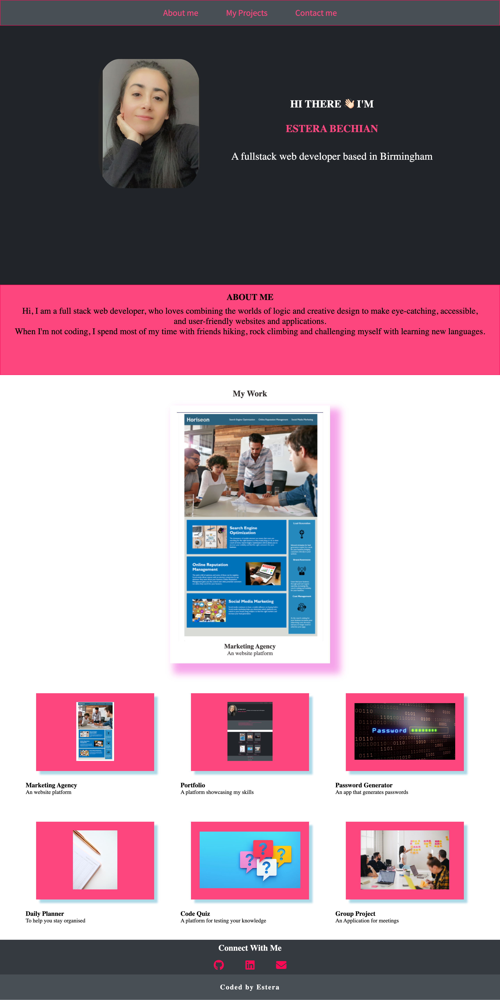
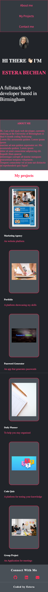

## Personal Portfolio

### 🚀 Getting started

My personal portfolio showcasing my projects.
For this project I builded this portfolio using Html and CSS to showcase all of the projects I have completed so far in my coding journey.
The portfolio webpage is fully responsive, mobile friendly.

### 🛠 Functionality

- Used Google fonts for an balanced typography
- Used FontAwesome libraries for a greater experience
- Made sure the links are all responsive
- Refactored the CSS code where possible
- Made the website responsive
- Made mobile responsive

### 💥 Deployed URL

- You can find the application deployed to github pages [here](https://estera09-ux.github.io/my-portfolio-project/)

### 💻 Technologies used

- HTML
- CSS
- Github Pages
- FontAwesome
- Google fonts

### 📷 Screenshots

## Desktop viewport

## Viewport

