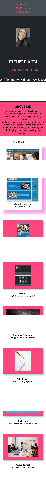

## Personal Portfolio

### 🚀 Getting started

My personal portfolio showcasing my projects.
For this projects we were asked to showcase our skills and projects.
The portfolio webpage is fully responsive, mobile friendly. There are six projects displayed, etc.

### 💥 Deployed URL

- You can find the application deployed to github pages [here](https://estera09-ux.github.io/my-portfolio-project/)

### 💻 Technologies used

- HTML
- CSS
- Github Pages
- FontAwesome
- Google fonts

### 📷 Screenshots

**Mobile-viewport**

**Desktop-viewport**

